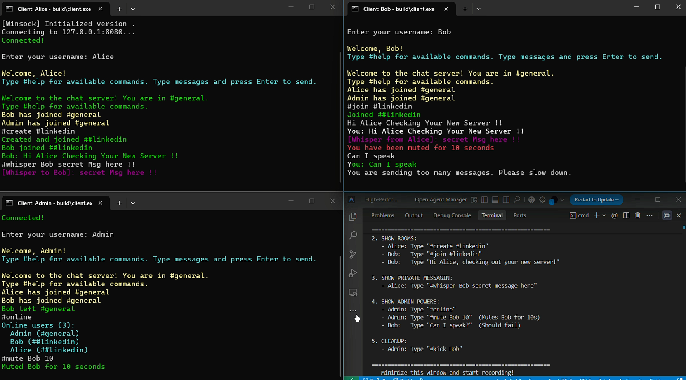

# Project Codebase Explanation

This document provides a detailed breakdown of the High-Performance Multi-Threaded Chat Server codebase, explaining the role of each file and the core logic implemented.

## Demo Screenshot



*Multiple clients connected to the chat server showing real-time messaging, room creation, private whispers, and admin commands.*

---

## Overview
This project is a high-performance chat server built for Windows using **I/O Completion Ports (IOCP)** for asynchronous networking and a custom **Thread Pool** for efficient task processing. It supports multiple chat rooms, persistent message logging, and administrative commands.

### Key Features Demonstrated:
- ✅ **Multi-client connections** - Alice, Bob, and Admin connected simultaneously
- ✅ **Real-time messaging** - Instant message delivery between clients
- ✅ **Chat rooms** - Create rooms (`#create`), join rooms (`#join`)
- ✅ **Private whispers** - `#whisper Bob secret message here`
- ✅ **Admin commands** - `#mute`, `#kick`, `#ban` for moderation
- ✅ **Online users** - `#online` to see who's connected
- ✅ **Message history** - `#history` to view recent messages

---

## File Breakdown

### 1. `server.cpp` (The Core Server Application)
**Role**: The entry point for the server application.
- **Initialization**: Sets up the global components: Thread Pool, Connection Manager, Chat Room Manager, Message Store, and IOCP Server.
- **Main Loop**: runs a loop that periodically handles background tasks like checking for timed-out connections.
- **Event Handlers**: Defines callback functions for server events:
    - `HandleConnect`: Validates IP rate limits, adds user to defaults channel (`#general`), and sends a welcome message.
    - `HandleDisconnect`: Cleans up user session, notifies room members of departure.
    - `HandleMessage`: Processes incoming text. Checks for spam, mutes, and parses commands (starting with `#`) or broadcasts standard messages.
    - `ProcessCommand`: Handles user commands like `#join`, `#create`, `#whisper`, `#kick`, etc.

### 2. `client.cpp` (The Chat Client)
**Role**: The client-side application for users to connect and chat.
- **Architecture**: multi-threaded implementation using two main threads:
    - **Main Thread (Sender)**: Reads user input from the console and sends it to the server. Handles local exit command.
    - **Receiver Thread (`ReceiveMessages`)**: Continuously waits for incoming data from the server and prints it to the console with color coding (e.g., yellow for system notices, magenta for whispers).
- **Features**: Supports ANSI colors for a better UI experience on Windows 10+.

### 3. `iocp_server.h/cpp` (Networking Engine)
**Role**: Wraps the complex Windows I/O Completion Port API into a cleaner class structure.
- **`IOCPServer` Class**:
    - Manage the listening socket and accepts new connections asynchronously.
    - Manages a pool of worker threads (`IOCPWorkerThread`) that wait for I/O completion events (read/write limits).
    - **Key Methods**:
        - `Start/Stop`: Lifecycle management.
        - `Send/Broadcast`: queuing update operations.
    - **Async Flow**: Uses `PostQueuedCompletionStatus` and `GetQueuedCompletionStatus` to distribute network events across threads efficiently.

### 4. `chat_room.h/cpp` (Room Management)
**Role**: Manages the logical grouping of users into chat rooms.
- **`Room` Struct**: Holds room metadata (name, topic, members, owner, visibility).
- **`ChatRoomManager` Class**:
    - **Container**: Uses a hash map to store active rooms.
    - **Operations**: `CreateRoom`, `JoinRoom`, `LeaveRoom`. It handles the logic of ensuring a user is only in one room at a time (switching rooms automatically moves them).
    - **Thread Safety**: Uses mutexes to ensure concurrent access to room data is safe.

### 5. `message_store.h/cpp` (Persistence & History)
**Role**: Handles the storage and retrieval of chat history.
- **Features**:
    - **In-Memory Cache**: Keeps the last `N` messages for each room for quick access (e.g., when a user joins or types `#history`).
    - **File Persistence**: Writes messages to a log file on disk (`./chat_logs/`) so history isn't lost on server restart.
    - **Search**: Provides a basic search capability (though simple linear scan for now).

### 6. `connection_manager.h/cpp` (Security & Stability)
**Role**: Protects the server from abuse and manages connection lifecycles.
- **Rate Limiting**: Tracks connection attempts per second to prevent DDoS-style flooding.
- **Spam Protection**: Limits messages per minute per user.
- **Moderation**: Handles administrative actions like Banning IPs or Muting users.
- **Timeouts**: Tracks last activity time and flags idle connections for disconnection.

### 7. `thread_pool.h/cpp` (Concurrency)
**Role**: A generic thread pool implementation to execute tasks in parallel.
- **Design**: Maintains a queue of `std::function` tasks and a set of worker threads.
- **Efficiency**: Prevents the overhead of creating/destroying threads for every small task. The server uses this to handle logic processing off the main I/O threads if needed.

### 8. `sockutil.h/cpp` (Socket Helpers)
**Role**: Utility functions to abstract raw Winsock calls.
- **Functions**: `CreateServerSocket`, `CreateClientSocket`, `InitializeWinsock`, `CleanupWinsock`.
- **Simplification**: Handles error checking and boilerplate code for setting up TCP sockets.

### 9. `win32_compat.h` (Cross-Version Compatibility)
**Role**: Provides helper definitions or wrappers for Windows-specific APIs to ensure smoother compilation and modernization where needed.

---

## Quick Start Guide

### Running the Server
```bash
cd build
server.exe 8080
```

### Connecting as Client
```bash
cd build
client.exe 127.0.0.1 8080
```

### Available Commands
| Command | Description |
|---------|-------------|
| `#help` | Show all commands |
| `#rooms` | List chat rooms |
| `#join <room>` | Join a room |
| `#create <room>` | Create new room |
| `#online` | List online users |
| `#whisper <user> <msg>` | Private message |
| `#history [n]` | Show last n messages |
| `#kick <user>` | (Admin) Kick user |
| `#mute <user> [sec]` | (Admin) Mute user |
| `#ban <user>` | (Admin) Ban IP |
| `#exit` | Disconnect |

---

## Build System

- **`CMakeLists.txt`**: The modern, cross-platform build configuration. Used to generate Visual Studio solutions or MinGW makefiles.
- **`build.bat`**: A convenience script for Visual Studio users to configure and compile the project quickly.
- **`build_mingw.bat`**: A convenience script for users using the MinGW (GCC for Windows) toolchain.
- **`DEMO_GUIDE.bat`**: Interactive step-by-step guide to test all features.

---

## Architecture Diagram

```
┌─────────────────────────────────────────────────────────────┐
│                    Chat Server Architecture                  │
├─────────────────────────────────────────────────────────────┤
│                                                              │
│  ┌──────────┐    ┌──────────┐    ┌──────────┐              │
│  │ Client 1 │    │ Client 2 │    │ Client N │              │
│  └────┬─────┘    └────┬─────┘    └────┬─────┘              │
│       │               │               │                     │
│       └───────────────┼───────────────┘                     │
│                       ▼                                     │
│  ┌─────────────────────────────────────────────────────┐   │
│  │              IOCP Server (iocp_server.cpp)           │   │
│  │  - Async I/O with Windows IOCP                       │   │
│  │  - Handles accept/read/write operations              │   │
│  └───────────────────────┬─────────────────────────────┘   │
│                          ▼                                  │
│  ┌─────────────────────────────────────────────────────┐   │
│  │              Thread Pool (thread_pool.cpp)           │   │
│  │  - N worker threads for parallel processing          │   │
│  └───────────────────────┬─────────────────────────────┘   │
│                          ▼                                  │
│  ┌─────────────┬─────────────────┬──────────────────┐      │
│  │ Chat Rooms  │ Message Store   │ Connection Mgr   │      │
│  │ (chat_room) │ (message_store) │ (connection_mgr) │      │
│  └─────────────┴─────────────────┴──────────────────┘      │
│                                                              │
└─────────────────────────────────────────────────────────────┘
```
